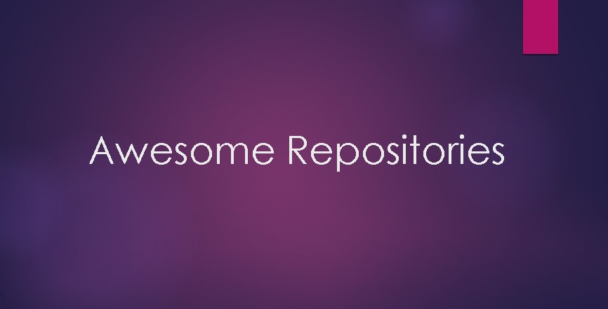

<h1 align='center'>Awesome Repositories</h1>

An awesome and curated list of best repositories related to various topics. Leave a star :star: to support this project

  
  
  

  Created by
  <a href="https://twitter.com/jashanbansal078">Jashan Bansal</a> 

 

*** 

## :notebook_with_decorative_cover: &nbsp;What is it?

> This repository aims to take all the awesome repositories present on github at one place, so that anyone can find them  easily and start learning as early as possible.

## :restroom: &nbsp;For whom?

> It is intended for everyone and anyone- especially for College students.

## :information_source: &nbsp;Contributing? :fire:

> This material is under construction! We have added some of the trending topics. There are so many more topics to add and there are so many cool repositories related to the existing topics are present, for which we are not aware but you are. You will probably find several typos also. So Please consider to add new topics/ new repositories in existing topics/ give your suggestion and raise issues about any bugs. Go to [CONTRIBUTING.md](CONTRIBUTING.md) to see how to contribute!  

## :sparkles: Tip

> Use CTRL + Click to open repository links in new tab.

# Table of Contents
<ul>
  <li><a href="#general">General</a></li>
  <li><a href="#github-resume" >Github Resume</a></li>
  <li><a href="#projects-related-tutorials">Projects related Repositories</a></li>
  <li><a href="#python-and-machine-learning">Python and Machine Learning</a></li>
  <li><a href="#javascript">JavaScript</a></li>
  <li><a href="#java">Java</a></li>
  <li><a href="#data-structures-and-algorithms">Data Structures and Algorithms</a></li>
  <li><a href="#sql">SQL</a></li>
  <li><a href="#git-github">Git/Github</a></li>
</ul>

<h2 id="general">General</h2>
<table>
  <thead>
    <th>SR NO.</th>
    <th>DESCRIPTION</th>
    <th>REFERENCE</th>
  </thead>
  <tbody>
    <tr>
      <td>1.</td>
      <td>Computer Science Learning Notes (Highly recommended)</td>
      <td><a href="https://github.com/CyC2018/CS-Notes">https://github.com/CyC2018/CS-Notes</a></td>
    </tr>
    <tr>
      <td>2.</td>
      <td>:mortar_board: Path to a free self-taught education in Computer Science!</td>
      <td><a href="https://github.com/ossu/computer-science">https://github.com/ossu/computer-science</a></td>
    </tr>
    <tr>
      <td>3.</td>
      <td>A complete computer science study plan to become a software engineer</td>
      <td><a href="https://github.com/jwasham/coding-interview-university">https://github.com/jwasham/coding-interview-university</a></td>
    </tr>
    <tr>
      <td>4.</td>
      <td>:books: List of Computer Science courses with video lectures.</td>
      <td><a href="https://github.com/Developer-Y/cs-video-courses">https://github.com/Developer-Y/cs-video-courses</a></td>
    </tr>
  </tbody>
</table>

<h2 id="github-resume">Github Resume</h2>
<table>
  <thead>
    <th>SR NO.</th>
    <th>DESCRIPTION</th>
    <th>REFERENCE</th>
  </thead>
  <tbody>
    <tr>
      <td>1.</td>
      <td>Automatically create the Resume of your Github profile by just star this repository :open_mouth:</td>
      <td><a href="https://github.com/resume/resume.github.com">https://github.com/resume/resume.github.com</a></td>
    </tr>
  </tbody>
</table>

<h2 id="projects-related-tutorials">Projects related Repositories</h2>
<table>
  <thead>
    <th>SR NO.</th>
    <th>DESCRIPTION</th>
    <th>REFERENCE</th>
  </thead>
  <tbody>
    <tr>
      <td>1.</td>
      <td>Curated list of project-based tutorials</td>
      <td><a href="https://github.com/tuvtran/project-based-learning">https://github.com/tuvtran/project-based-learning</a></td>
    </tr>
    <tr>
      <td>2.</td>
      <td>A list of awesome beginners-friendly projects!</td>
      <td><a href="https://github.com/MunGell/awesome-for-beginners">https://github.com/MunGell/awesome-for-beginners</a></td>
    </tr>
    <tr>
      <td>3.</td>
      <td>:page_facing_up: A list of practical projects that anyone can solve in any programming language. </td>
      <td><a href="https://github.com/karan/Projects">https://github.com/karan/Projects</a></td>
    </tr>
    <tr>
      <td>4.</td>
      <td>Repository contains Links to solutions of Projects of No. 3 Repository given.</td>
      <td><a href="https://github.com/karan/Projects-Solutions">https://github.com/karan/Projects-Solutions</a></td>
    </tr>
  </tbody>
</table>

<h2 id="python-and-machine-learning">Python and Machine Learning</h2>
<table>
  <thead>
    <th>SR NO.</th>
    <th>DESCRIPTION</th>
    <th>REFERENCE</th>
  </thead>
  <tbody>
    <tr>
      <td>1.</td>
      <td>:books: A practical approach to learning machine learning.</td>
      <td><a href="https://github.com/GokuMohandas/practicalAI">https://github.com/GokuMohandas/practicalAI</a></td>
    </tr>
    <tr>
      <td>2.</td>
      <td>Machine learning and deep learning tutorials, articles and other resources </td>
      <td><a href="https://github.com/ujjwalkarn/Machine-Learning-Tutorials">https://github.com/ujjwalkarn/Machine-Learning-Tutorials</a></td>
    </tr>
    <tr>
      <td>3.</td>
      <td>Open Machine Learning Course!</td>
      <td><a href="https://github.com/Yorko/mlcourse.ai">https://github.com/Yorko/mlcourse.ai</a></td>
    </tr>
    <tr>
      <td>4.</td>
      <td>A complete daily plan for studying to become a machine learning engineer!</td>
      <td><a href="https://github.com/ZuzooVn/machine-learning-for-software-engineers">https://github.com/ZuzooVn/machine-learning-for-software-engineers</a></td>
    </tr>
    <tr>
      <td>5.</td>
      <td>:books: VIP cheatsheets for Stanford's CS 229 Machine Learning.</td>
      <td><a href="https://github.com/afshinea/stanford-cs-229-machine-learning">https://github.com/afshinea/stanford-cs-229-machine-learning</a></td>
    </tr>
  </tbody>
</table>

<h2 id="javascript">Javascript</h2>
<table>
  <thead>
    <th>SR NO.</th>
    <th>DESCRIPTION</th>
    <th>REFERENCE</th>
  </thead>
  <tbody>
    <tr>
      <td>1.</td>
      <td>JavaScript Style Guide</td>
      <td><a href="https://github.com/airbnb/javascript">https://github.com/airbnb/javascript</a></td>
    </tr>
    <tr>
      <td>2.</td>
      <td>Clean Code concepts adapted for JavaScript</td>
      <td><a href="https://github.com/ryanmcdermott/clean-code-javascript">https://github.com/ryanmcdermott/clean-code-javascript</a></td>
    </tr>
    <tr>
      <td>3.</td>
      <td>Curated collection of useful JavaScript snippets that you can understand in 30 seconds or less.</td>
      <td><a href="https://github.com/30-seconds/30-seconds-of-code">https://github.com/30-seconds/30-seconds-of-code</a></td>
    </tr>
    <tr>
      <td>4.</td>
      <td>JavaScript Patterns</td>
      <td><a href="https://github.com/shichuan/javascript-patterns">https://github.com/shichuan/javascript-patterns</a></td>
    </tr>
  </tbody>
</table>

<h2 id="java">Java</h2>
<table>
  <thead>
    <th>SR NO.</th>
    <th>DESCRIPTION</th>
    <th>REFERENCE</th>
  </thead>
  <tbody>
    <tr>
      <td>1.</td>
      <td>Java Tutorial For Beginners - Companion Reference(Short and complete)</td>
      <td><a href="https://github.com/in28minutes/java-cheat-sheet">https://github.com/in28minutes/java-cheat-sheet</a></td>
    </tr>
    <tr>
      <td>2.</td>
      <td>A Java 8+ Cheat Sheet for functional programming!</td>
      <td><a href="https://github.com/BafS/Java8-CheatSheet">https://github.com/BafS/Java8-CheatSheet</a></td>
    </tr>
    <tr>
      <td>3.</td>
      <td>Modern Java - A Guide to Java 8.</td>
      <td><a href="https://github.com/winterbe/java8-tutorial">https://github.com/winterbe/java8-tutorial</a></td>
    </tr>
  </tbody>
</table>

<h2 id="data-structures-and-algorithms">Data Structures and Algorithms</h2>
<table>
  <thead>
    <th>SR NO.</th>
    <th>DESCRIPTION</th>
    <th>REFERENCE</th>
  </thead>
  <tbody>
    <tr>
      <td>1.</td>
      <td>Algorithms and Data Structures implemented in Java</td>
      <td><a href="https://github.com/TheAlgorithms/Java">https://github.com/TheAlgorithms/Java</a></td>
    </tr>
    <tr>
      <td>2.</td>
      <td>Minimal examples of data structures and algorithms in Python</td>
      <td><a href="https://github.com/keon/algorithms">https://github.com/keon/algorithms</a></td>
    </tr>
    <tr>
      <td>3.</td>
      <td>Algorithms and data structures implemented in JavaScript with explanations and links to further readings</td>
      <td><a href="https://github.com/trekhleb/javascript-algorithms">https://github.com/trekhleb/javascript-algorithms</a></td>
    </tr>
    <tr>
      <td>4.</td>
      <td>All Algorithms implemented in C</td>
      <td><a href="https://github.com/TheAlgorithms/C">https://github.com/TheAlgorithms/C</a></td>
    </tr>
    <tr>
      <td>5.</td>
      <td>Algorithms and Data Structures implemented in Python</td>
      <td><a href="https://github.com/TheAlgorithms/Python">https://github.com/TheAlgorithms/Python</a></td>
    </tr>
  </tbody>
</table>

<h2 id="sql">SQL</h2>
<table>
  <thead>
    <th>SR NO.</th>
    <th>DESCRIPTION</th>
    <th>REFERENCE</th>
  </thead>
  <tbody>
    <tr>
      <td>1.</td>
      <td>Most recommended guide to learn SQL</td>
      <td><a href="https://github.com/CyC2018/CS-Notes/blob/master/docs/notes/SQL.md">https://github.com/CyC2018/CS-Notes/blob/master/docs/notes/SQL.md</a></td>
    </tr>
  </tbody>
</table>

<h2 id="git-github">Git/Github</h2>
<table>
  <thead>
    <th>SR NO.</th>
    <th>DESCRIPTION</th>
    <th>REFERENCE</th>
  </thead>
  <tbody>
    <tr>
      <td>1.</td>
      <td>Most recommended guide to learn Git basics</td>
      <td><a href="https://github.com/CyC2018/CS-Notes/blob/master/docs/notes/Git.md">https://github.com/CyC2018/CS-Notes/blob/master/docs/notes/Git.md</a></td>
    </tr>
    <tr>
      <td>2.</td>
      <td>Git and git flow cheat sheet</td>
      <td><a href="https://github.com/arslanbilal/git-cheat-sheet">https://github.com/arslanbilal/git-cheat-sheet</a></td>
    </tr>
    <tr>
      <td>3.</td>
      <td>A list of cool features of Git and GitHub.</td>
      <td><a href="https://github.com/tiimgreen/github-cheat-sheet">https://github.com/tiimgreen/github-cheat-sheet</a></td>
    </tr>
  </tbody>
</table>

